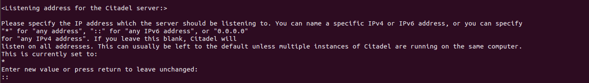

# Citadel Email Server Setup
Citadel-Suite is easy, versatile, and powerful, thanks to its exclusive "rooms" based architecture and is a plaform packed with various operations that includes the feature in focus _email_. Our application sets up the citadel email server (citadel suite) on the RPI4B in a docker container and allows different users to communicate with each other through server using a browser. The browser is placed in the client machine (on the VM) which is connected to the server in the same LAN.

## Server (on RPI4B)
The server on the RPI4B in a docker container. The server is an email server, which we have chose to be Citadel server, and it handles in-bound and out-bound mails.

## Client (on VM)
The client that communicates with the email server in the RPI4 is a web browser, which we have chosen to be _firefox web browser_. It connects from the VM to the server in RPI and the multiple users can send mail with each other.

# Build environments
## Server (on RPI4B)
* Instructions for building Docker container
    * Running the Dockerfile available in the _Build Server Environment_ folder will provide a container that contains build script. The exact steps are as follows:
    1. The docker image can be initially build using the command:
    
            docker build -t serverbuild:v1 .
    2. The docker image created _serverbuild:v1_ can be run as a container, bubt since we need it to have systemd services, we need to run it with privilege, this can be done with the following command:

            docker run -d --name serverbuild --privileged -v /sys/fs/cgroup:/sys/fs/cgroup:ro --network host serverbuild:v1

    3. We need to now access the interactive bash shell of the container to run the build script, this can be done with the following command:

            docker exec -it serverbuild bash
    4. Inside the docker container _serverbuild_  we need to install our email server citadel suite. This can bbe done by running the following commands:

            cd server
            ./install.sh

     5. There are several user prompts required to complete build script install.sh, the guide for the inputs is provided in the next section. We can now commit the changes done to the container and then create our _serverruntime_ image as follows:

                exit
                docker ps -a
        Look for the container id of the _serverbuild_ contianer, let that be [serverbuild_container_id]. 
        
        
        
        Now with that value we perform the following command to commit:
        
                docker commit [serverbuild_container_id] serverruntime

        Hence we obtain our _serverruntime_ image.

        

* Instructions for running build scripts in container:
    * Running the build script install.sh inside the container will produce an output similar to provided below:

    

    1. Since the citadel suite requires a lot of dependancies to installed before configuration, the initial prompts will all be "yes".

    2. If the following user prompt occurs, then the geographic and other details are to be provided according to the user.

    
    
    3. After providing the inputs for the prompts. The script will install the server in the container.
    
    4. The server will now ask for configurations, 
        
        Q: what is the username? 
        
        A: You can provide a username or use default value "admin" will be configured.

    

    5. 
        Q: What is the password? 
        
        A: You can provide a password here, or default password "citadel" will be configured.

    

    6. 
        Q: What is the user id? 
        
        A: You can provide a user id or use default value "root".

    

    7. 
        Q: What is the listening IP address IPv4 or IPv6? 
        
        A: Please provide "::" without quotes for this prompt, else the configuration won't work.

    

    8. 
        Q: What is the port? 
        
        A: By default IANA has assigned port 504 for the Citadel suite. If some application is running in this port, you can provide another port number.

    

     9. 
        Q: What is the authentication mode? 
        
        A: The default method of "0. Self contained authentication" seemed satisfactory.

    

    10. 
        Q: HTTP/HTTPS port used by the WebCit instances. 

        A: These are provided as 80 and 443, the default HTTP and HTTPS ports.

    

    11. Now the configuration is done. This can be verified with the following command:

                service citadel status

    

## Client (on VM)

Since our application was an email server, the client used for communicating with the server is a web browser, which can be obtained in the VM freely and does not require any configurations or instalations. We are going to use Firefox web browser as the client that communicates with the runtime server container.

# Runtime environments

## Server (on RPI4B)
* Instructions for running the Docker container
    * In the previous steps we have setup our runtime server image _serverruntime_ in the RPI4, which we will be using now.

    1. We can run this docker image with the following command:

            docker run -d --name serverruntime --privileged -v /sys/fs/cgroup:/sys/fs/cgroup:ro --network host serverruntime
    
    2. We now need to note the IP address of the RPI4, as [serverip], since this is essenntial for the client to make contact with.

        

## Client (on VM)
* Instructions for running the client:
    1. Open the firefox browser and enter the IP address [serverip] of the RPI4 found in the previous section.

        
    2. Here we can see that browser from the VM can directly connect to the server running on the container that is on the RPI4.
        

The users can now freely access the container server running on the RPI4 and access the account and send emails among each other.

I have created another user test@ubuntu other than the default user admin@ubuntu for the working of the email server. The following screenshot shows how the emails are send and recieved by these users:

1. Login as user test:

2. Send e-mail from test@ubuntu to admin@ubuntu:

3. Login as user admin:

2. Receive e-mail from test@ubuntu:
